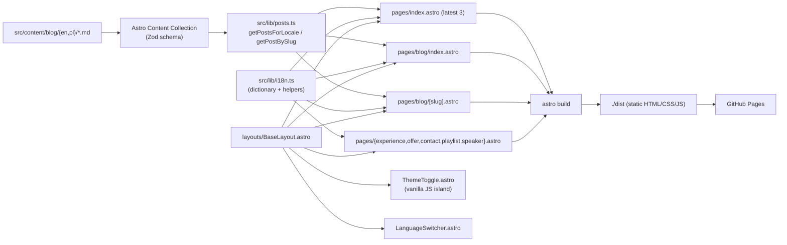

# Requirements

### Overview & Goals
Migrate the current Next.js 15 (App Router, static export) personal blog/portfolio to **Astro** (latest stable, v5+) using **Content Collections**. The site continues to be deployed to GitHub Pages as a fully static artifact, but benefits from Astro's zero-JS-by-default model, native content schema validation, simpler i18n, and a smaller, faster bundle.

The migration is a 1:1 functional port of every page that exists today; no new features are introduced. After migration the project removes the Next.js framework, the API routes, the cookie-based admin session, and the manual `posts.json` registry — replacing them with idiomatic Astro equivalents.

### Scope
**In Scope**
- Replace Next.js with Astro as the build framework.
- Convert all pages under `src/app/**` to Astro pages under `src/pages/**`.
- Replace `src/content/posts.json` + `src/lib/posts.ts` with an Astro Content Collection (Zod schema).
- Convert i18n from cookie-based to path-based routing (`/en/...`, `/pl/...`) with an English default that redirects from `/`.
- Reimplement interactive UI (theme toggle, language switcher, mobile menu) as Astro components with vanilla JS — no React/Preact runtime.
- Keep Tailwind CSS, `@tailwindcss/typography`, `lucide` icons, and the existing visual design unchanged.
- Update the GitHub Actions workflow to build Astro instead of Next.js.
- Remove obsolete code: `src/app/api/**`, `src/lib/auth.ts`, the React `login` page, `next.config.mjs`, Next-only deps.

**Out of Scope**
- New features (newsletter, comments, search, OG image generation, CMS UI).
- Refactoring/restyling pages beyond what's required to render under Astro.
- Writing/editing the actual blog post content (mock posts remain mock posts).
- Migrating to MDX (stay on `.md`; MDX can be added later as a follow-up).

### User Stories
- **As a visitor**, I can browse every existing page (`/`, `/blog`, `/blog/<slug>`, `/playlist`, `/speaker`, `/experience`, `/offer`, `/contact`) in both English and Polish and see the same content as today.
- **As a visitor**, I can switch language and the URL reflects the choice (`/en/blog` ⇄ `/pl/blog`), so I can share locale-specific links.
- **As a visitor**, I can toggle light/dark mode and the choice persists across navigation.
- **As the site owner**, I can add a new post by dropping two Markdown files (`*.md`, `*.pl.md`) into `src/content/blog/` — no JSON registry to maintain — and the frontmatter is type-checked at build time.
- **As the site owner**, I can mark a post `draft: true` in frontmatter and it will be excluded from the production build automatically.
- **As the site owner**, I keep deploying by pushing to `main`; the GitHub Action publishes the new static artifact to GitHub Pages.

### Functional Requirements
- All routes produced today must continue to resolve (with the new locale prefix scheme; see *Key Decisions*).
- The home page's "Latest from the blog" must show the 3 most recent **published** posts.
- The blog index sorts by `publishedAt` descending.
- Blog post pages must render Markdown to HTML preserving the current Tailwind Typography styling.
- The active locale must influence: post title/description selection, date formatting, all UI strings, and the `<html lang>` attribute.
- Theme toggle must be SSR-safe (no flash of incorrect theme) using the same inline boot script approach used today in `layout.tsx`.
- The 404 path must render a styled page in both locales.

### Non-Functional Requirements
- **Performance**: Lighthouse Performance ≥ 95 on the home page after migration; total JS shipped to a Markdown post page ≤ 5 KB gzipped.
- **SEO**: Each locale variant has the correct `<html lang>`, canonical link, and `hreflang` alternates between `/en/...` and `/pl/...`.
- **Compatibility**: Site continues to be hosted on GitHub Pages with the existing `CNAME`. No server runtime required.
- **Build time**: `astro build` completes in CI in under 60s for the current content volume.
- **DX**: `npm run dev` provides hot-reload of pages, components, and content collection entries.

# Technical Design

### Current Implementation
- **Framework**: Next.js `15.2.0-canary.19` (App Router), React 19, Tailwind 3.4, deployed as a static export via `actions/deploy-pages` (see `.github/workflows/deploy.yml`). `next.config.mjs` only sets `images.unoptimized: true`.
- **Content layer**: `src/content/posts.json` is the registry; each entry has `slug`, `fileName`, `fileNamePl`, `title`, `titlePl`, `description`, `descriptionPl`, `publishedAt`, `status` (`'published' | 'draft'`). Markdown files live in `src/content/posts/*.md` (and `*.pl.md`). `src/lib/posts.ts` reads the JSON, filters by `status`, optionally swaps to PL fields, and renders with `remark` + `remark-html`.
- **i18n**: A single hardcoded dictionary in `src/lib/i18n.ts` keyed by `Locale = 'en' | 'pl'`. The current locale is read from a `locale` cookie via `src/lib/i18n.server.ts::getLocaleFromCookies` and passed to every server component. URLs are locale-agnostic.
- **Auth/drafts**: `src/lib/auth.ts` issues an HMAC-signed `admin_session` cookie. `src/app/api/auth/login/route.ts` + `.../logout/route.ts` set/clear the cookie. `src/app/login/page.tsx` posts to that route. Authenticated users see `status: 'draft'` posts. **This does not work on GitHub Pages** because the static export has no `/api/*` runtime.
- **Pages** (`src/app/`): `page.tsx` (home with about + latest 3), `blog/page.tsx` (index), `blog/[slug]/page.tsx` (detail + draft gate), and static pages `experience`, `offer`, `contact`, `playlist`, `speaker`, `login`.
- **Components** (`src/components/`): `MainNavigationLinks` (client, uses `usePathname`), `LanguageSwitcher` (client, writes cookie), `ThemeToggle` (client), `AuthStatus` (client, calls `/api/auth/logout`), `PostList`.
- **Layout**: `src/app/layout.tsx` renders header/footer, runs an inline pre-hydration script to set the dark class, and reads the session cookie to decide what to show.

### Key Decisions
1. **Astro v5 + Content Collections (Zod schema)** — replaces `posts.json` + `src/lib/posts.ts`. Frontmatter is validated at build time; `getCollection('blog', ({ data }) => !data.draft)` filters drafts. Rationale: native solution, type-safe, removes ~120 LOC of glue code.
2. **Path-based i18n with English at root** (`/`, `/blog`, `/pl`, `/pl/blog`) using Astro's built-in `i18n` config (`defaultLocale: 'en'`, `routing: 'prefix-other-locales'`). Rationale: SEO-friendly, shareable locale URLs, idiomatic for Astro, removes the need for cookies and server reads on every request.
3. **Drop admin/login/drafts-at-runtime entirely**; rely solely on `draft: true` in frontmatter, which is excluded from the build by `getCollection`. Rationale: there is no server runtime on GitHub Pages, so the current login is non-functional. This deletes `src/app/api/**`, `src/lib/auth.ts`, `src/app/login/`, and `src/components/AuthStatus.tsx`.
4. **Plain Astro components + vanilla JS for islands** — no `@astrojs/react`, no `@astrojs/preact`. The three interactive needs (theme toggle, language switcher dropdown, mobile menu via `<details>`) are trivial DOM event handlers in a small `<script>` block. Rationale: smallest possible JS payload, matches user choice; React was only used because Next required it.
5. **Bilingual posts stay as two sibling files** (`hello-world.md`, `hello-world.pl.md`) but are organised into per-locale subfolders (`src/content/blog/en/`, `src/content/blog/pl/`) and linked via a shared `slug` in frontmatter. Rationale: Astro Content Collections work most cleanly when each entry is one file; sibling-pair lookup by slug keeps the API simple and avoids forcing a separate `translations` collection.
6. **Keep Tailwind via `@astrojs/tailwind`** (or Tailwind v4 Vite plugin) with the existing `tailwind.config.js` and `src/styles/globals.css` reused as-is. Rationale: zero visual regression, no design rewrite.
7. **In-place migration on a feature branch**, not a parallel app. The Next.js `src/app/**` tree is removed once the Astro equivalent is verified. Rationale: avoids a long-lived dual codebase and keeps PR review focused.

### Proposed Changes
**Add**
- `astro.config.mjs` — Astro config with Tailwind integration, sitemap, `i18n: { defaultLocale: 'en', locales: ['en', 'pl'], routing: { prefixDefaultLocale: false } }`, and `site: 'https://superdyzio.dev'`.
- `src/content.config.ts` — declares the `blog` collection with a Zod schema (`title`, `description`, `publishedAt: z.coerce.date()`, `draft: z.boolean().default(false)`, `lang: z.enum(['en','pl'])`, `slug` shared across locales).
- `src/content/blog/en/*.md` and `src/content/blog/pl/*.md` — Markdown files with frontmatter (migrated from current files + `posts.json`).
- `src/layouts/BaseLayout.astro` — header, footer, `<head>`, theme boot script, locale-aware nav.
- `src/layouts/PostLayout.astro` — article wrapper with prose styling.
- `src/pages/index.astro`, `src/pages/blog/index.astro`, `src/pages/blog/[slug].astro`, plus `experience.astro`, `offer.astro`, `contact.astro`, `playlist.astro`, `speaker.astro`, `404.astro`.
- `src/pages/pl/**` — Polish equivalents (same set of files) using `Astro.currentLocale`.
- `src/components/*.astro` — `MainNav.astro`, `LanguageSwitcher.astro`, `ThemeToggle.astro`, `PostList.astro`, `MobileMenu.astro` with inline `<script>` for behaviour.
- `src/lib/i18n.ts` (kept and trimmed) — exports the translation dictionary, a `useTranslations(locale)` helper, and `formatDate(date, locale)`. The cookie-related code is removed.
- `src/lib/posts.ts` (rewritten) — thin wrapper around `getCollection('blog')` that filters by locale, drafts, and sorts by date.

**Modify**
- `package.json` — replace Next/React deps with Astro deps; update scripts (`dev`, `build`, `preview`).
- `tailwind.config.js` — update `content` globs to `./src/**/*.{astro,html,js,jsx,ts,tsx,md,mdx}`.
- `.github/workflows/deploy.yml` — replace the `next build` step with `astro build`; artifact path stays `./dist` (Astro default) instead of `./out`.
- `tsconfig.json` — extend `astro/tsconfigs/strict`; keep `@/*` path alias.
- `README.md` — update the "How to add a new post" section and tech-stack section.

**Remove**
- `next.config.mjs`, `next-env.d.ts`.
- `src/app/**` (entire directory after parity is verified).
- `src/app/api/auth/login/route.ts`, `.../logout/route.ts`.
- `src/lib/auth.ts`, `src/lib/i18n.server.ts` (cookie-based locale reader no longer needed).
- `src/content/posts.json`.
- `src/components/AuthStatus.tsx`.
- `out/` (Next-only build output; replaced by `dist/`).

### Data Models / Contracts
```ts
// src/content.config.ts
import { defineCollection, z } from 'astro:content';

const blog = defineCollection({
  type: 'content',
  schema: z.object({
    slug: z.string(),               // shared across locales: e.g. 'hello-world'
    lang: z.enum(['en', 'pl']),
    title: z.string(),
    description: z.string(),
    publishedAt: z.coerce.date(),
    draft: z.boolean().default(false),
  }),
});

export const collections = { blog };
```

```ts
// src/lib/posts.ts (rewritten)
import { getCollection, type CollectionEntry } from 'astro:content';
import type { Locale } from '@/lib/i18n';

export async function getPostsForLocale(locale: Locale): Promise<CollectionEntry<'blog'>[]> {
  const all = await getCollection('blog', ({ data }) => data.lang === locale && !data.draft);
  return all.sort((a, b) => b.data.publishedAt.getTime() - a.data.publishedAt.getTime());
}

export async function getPostBySlug(locale: Locale, slug: string) {
  const all = await getCollection('blog', ({ data }) => data.lang === locale && data.slug === slug);
  return all[0] ?? null;
}
```

Frontmatter example after migration (`src/content/blog/en/hello-world.md`):
```yaml
---
slug: hello-world
lang: en
title: Hello World
description: Welcome to my new blog!
publishedAt: 2026-01-28
draft: false
---
```

### Components
- **`BaseLayout.astro`** *(replaces `src/app/layout.tsx`)* — renders `<html lang>`, head tags, the inline theme-init script, header, `<slot/>`, and footer. Receives `title`, `description`, `locale` props.
- **`MainNav.astro`** *(replaces `MainNavigationLinks.tsx`)* — server-rendered link list; active state computed from `Astro.url.pathname`. No client JS.
- **`LanguageSwitcher.astro`** *(replaces `LanguageSwitcher.tsx`)* — renders two anchors that swap the locale prefix in the current path; tiny vanilla `<script>` only if a dropdown UX is needed.
- **`ThemeToggle.astro`** *(replaces `ThemeToggle.tsx`)* — `<button>` with a 10-line inline `<script>` toggling `documentElement.classList` and `localStorage['theme']`.
- **`MobileMenu.astro`** — uses `<details>` for zero-JS expand/collapse (matches the existing `<details>` usage in `layout.tsx`).
- **`PostList.astro`** *(replaces `PostList.tsx`)* — takes `posts` and `locale` props; renders the same Tailwind markup.
- **`PostLayout.astro`** *(replaces the article markup in `blog/[slug]/page.tsx`)* — wraps `<slot/>` in the prose container; receives post frontmatter for the header.
- **`AuthStatus.tsx`** — **removed**.

### File Structure
```
superdyzio.github.io/
├── astro.config.mjs                     # NEW
├── tailwind.config.js                   # MODIFIED (content globs)
├── tsconfig.json                        # MODIFIED (extends astro/tsconfigs/strict)
├── package.json                         # MODIFIED (deps + scripts)
├── .github/workflows/deploy.yml         # MODIFIED (astro build, ./dist)
├── public/CNAME                         # unchanged
├── src/
│   ├── content.config.ts                # NEW (Zod schema)
│   ├── content/blog/
│   │   ├── en/hello-world.md            # MIGRATED (frontmatter added)
│   │   ├── en/mock-post-1.md
│   │   ├── en/mock-post-2.md
│   │   ├── en/mock-post-3.md            # draft: true
│   │   ├── en/mock-post-4.md            # draft: true
│   │   └── pl/<same set>.md
│   ├── layouts/
│   │   ├── BaseLayout.astro             # NEW
│   │   └── PostLayout.astro             # NEW
│   ├── pages/
│   │   ├── index.astro                  # home (EN default)
│   │   ├── 404.astro
│   │   ├── blog/index.astro
│   │   ├── blog/[slug].astro
│   │   ├── experience.astro
│   │   ├── offer.astro
│   │   ├── contact.astro
│   │   ├── playlist.astro
│   │   ├── speaker.astro
│   │   └── pl/<same structure>
│   ├── components/
│   │   ├── MainNav.astro
│   │   ├── LanguageSwitcher.astro
│   │   ├── ThemeToggle.astro
│   │   ├── MobileMenu.astro
│   │   └── PostList.astro
│   ├── lib/
│   │   ├── i18n.ts                      # MODIFIED (cookie code removed)
│   │   └── posts.ts                     # REWRITTEN
│   └── styles/globals.css               # unchanged
└── (REMOVED) src/app/, src/lib/auth.ts, src/lib/i18n.server.ts,
             src/content/posts.json, src/components/AuthStatus.tsx,
             next.config.mjs, next-env.d.ts, out/
```

### Architecture Diagram


### Risks
- **URL change for Polish content**: today PL is selected via cookie on the same URL; after migration PL URLs become `/pl/...`. *Mitigation*: there are likely no inbound PL links yet (the site is recent); add a small client redirect from `?lang=pl` if needed, and document the change in the README.
- **Theme flash on first paint**: must keep the inline `<script>` in `<head>` before any styled element renders — Astro lets us inline it the same way `layout.tsx` does today.
- **Lost `slug`/file ordering**: the current `posts.json` defines an ordering implicitly; the new flow sorts strictly by `publishedAt`. *Mitigation*: confirm all posts have a `publishedAt` and back-date drafts if needed.
- **`generateStaticParams` parity**: Astro's `getStaticPaths` must enumerate every `(locale, slug)` pair, including drafts in dev but excluding them in production via `import.meta.env.PROD`.
- **Tailwind v3 vs v4**: stay on Tailwind v3 via `@astrojs/tailwind` to avoid an unrelated upgrade; a Tailwind v4 migration can follow separately.
- **Lucide icons in `.astro`**: `lucide-react` is React-only; switch the four usages (`Mail`, `Linkedin`, `Twitter`, `Github`, `Code2`, `Users`, `Presentation`, `Lightbulb`) to **`lucide`** (vanilla) or inline SVGs. *Mitigation*: a small `Icon.astro` wrapper that emits the SVG markup.

# Testing

### Validation Approach
The migration is verified by running both the old and new builds locally and comparing outputs, then by running the new build in CI and visually inspecting the deployed GitHub Pages site. There is no existing test suite in the project, so validation is primarily build-time + manual smoke tests, not unit tests.

### Key Scenarios
- `npm run build` (Astro) completes with zero errors and zero schema violations for any post frontmatter.
- `dist/` contains an `index.html` for every expected route: `/`, `/blog/`, `/blog/<slug>/` for each published English post, `/pl/`, `/pl/blog/`, `/pl/blog/<slug>/` for each published Polish post, plus `/experience/`, `/offer/`, `/contact/`, `/playlist/`, `/speaker/` and their `/pl/...` counterparts, plus `/404.html`.
- The home page (`/`) shows exactly the 3 latest **published** posts (drafts `mock-post-3`, `mock-post-4` excluded).
- Switching language on any page navigates to the same page under the other locale prefix and shows the translated title/description/UI labels.
- Toggling dark mode persists across navigation and survives a hard reload without a flash of incorrect theme.
- A draft post (`draft: true`) is not present in `dist/` after `astro build` (production build).
- A Markdown post renders with the same Tailwind Typography styling as today (headings, paragraphs, links).
- All external links in `/speaker`, `/contact`, `/playlist` still open in a new tab with `rel="noopener noreferrer"`.
- `<html lang>` matches the active locale on every page.

### Edge Cases
- A post missing `lang` or with an invalid `publishedAt` must cause `astro build` to fail with a clear schema error (verifies the Zod schema is wired correctly).
- A `slug` that exists only in EN (no PL sibling) must still build; the PL blog index simply omits it.
- Visiting `/blog/<slug>` where `<slug>` does not exist returns the styled 404 page (not a blank one).
- Visiting `/pl` directly (without trailing path) renders the PL home, not a redirect loop.
- The site continues to be served correctly under the custom domain defined in `public/CNAME` (no Astro `base` path is needed because the site is at the root of the custom domain).

### Test Changes
No automated test suite exists in the project today, and the user has not asked for one. No tests are added. Validation is performed by:
- `npm run build && npm run preview` locally to walk every route.
- A diff of the `dist/` route list against the current `out/` route list to confirm parity (minus removed routes: `/login`, `/api/*`).
- A CI build on a PR branch before merging to `main`.

# Delivery Steps

###   Step 1: Bootstrap Astro alongside Next.js with shared tooling
An Astro 5 project is initialized in the repository, configured for Tailwind, TypeScript, and static GitHub Pages output, and runs in parallel to the existing Next.js code until parity is reached.

- Add `astro`, `@astrojs/tailwind`, `@astrojs/sitemap`, and `astro/tsconfigs/strict` to `package.json`; remove `next`, `react`, `react-dom`, `eslint-config-next` in a later cleanup stage (not now).
- Create `astro.config.mjs` with `site: 'https://superdyzio.dev'`, `output: 'static'`, Tailwind integration, sitemap integration, and `i18n: { defaultLocale: 'en', locales: ['en', 'pl'], routing: { prefixDefaultLocale: false } }`.
- Update `tsconfig.json` to extend `astro/tsconfigs/strict` and keep the `@/*` path alias pointing at `src/*`.
- Update `tailwind.config.js` content globs to include `.astro`, `.md`, `.mdx` in addition to existing TS/TSX globs.
- Add `dev`, `build`, `preview`, and `astro` npm scripts; keep `next dev`/`next build` available temporarily.
- Reuse `src/styles/globals.css` from the Astro layout once it is created in stage 3 (no edits to the file).
- Verify `npm run build` (Astro) compiles an empty default Astro starter page without errors.

###   Step 2: Define the blog Content Collection and migrate Markdown posts
All posts live in a typed Astro Content Collection; the `posts.json` registry and `src/lib/posts.ts` reading logic are replaced by `getCollection('blog')`.

- Create `src/content.config.ts` exporting a `blog` collection with the Zod schema described in Technical Design (`slug`, `lang`, `title`, `description`, `publishedAt: z.coerce.date()`, `draft: z.boolean().default(false)`).
- Move existing Markdown into `src/content/blog/en/` and `src/content/blog/pl/` (one file per locale per post: `hello-world.md`, `mock-post-1.md`, ..., `mock-post-4.md` and their `.pl` siblings renamed to plain `.md` under `pl/`).
- For each file, prepend YAML frontmatter populated from the corresponding `posts.json` entry (mapping `status: 'draft'` → `draft: true`, copying `titlePl`/`descriptionPl`/`fileNamePl` into the PL sibling).
- Rewrite `src/lib/posts.ts` as a thin wrapper around `getCollection('blog')`: `getPostsForLocale(locale)` (sorted by `publishedAt` desc, drafts excluded in prod) and `getPostBySlug(locale, slug)`.
- Delete `src/content/posts.json` only after the new schema validates and the rewritten `posts.ts` compiles.
- Verify `astro build` reports the expected number of `blog` entries and no schema errors.

###   Step 3: Implement BaseLayout, i18n helpers, and the locale-aware routing shell
A single Astro layout renders header/footer/theme-init for every page, and a path-based i18n model replaces the cookie-based one.

- Create `src/layouts/BaseLayout.astro` that accepts `title`, `description`, and `locale` props, sets `<html lang={locale}>`, includes the existing inline theme-init script verbatim from `src/app/layout.tsx`, and renders header + `<slot/>` + footer (markup copied from `layout.tsx`).
- Trim `src/lib/i18n.ts`: keep `locales`, `Locale`, `defaultLocale`, `isLocale`, `getTranslations`, `formatDate`; remove `LOCALE_COOKIE_NAME`.
- Add `getLocaleFromUrl(url: URL): Locale` helper deriving the active locale from the path (`/pl/...` → `pl`, else `en`).
- Delete `src/lib/i18n.server.ts` (cookie-based reader no longer needed).
- Create a placeholder `src/pages/index.astro` and `src/pages/pl/index.astro` that consume `BaseLayout` to validate the layout renders correctly in both locales.
- Verify dark-mode boot script runs before first paint (no FOUC) by previewing the dev server.

###   Step 4: Reimplement interactive components as Astro + vanilla JS islands
Theme toggle, language switcher, main nav, and mobile menu are rebuilt without React; each ships only the JS strictly needed for its behaviour.

- Create `src/components/MainNav.astro` (replaces `MainNavigationLinks.tsx`): server-renders the nav links and computes the active class from `Astro.url.pathname` and the current locale; no client JS.
- Create `src/components/LanguageSwitcher.astro` (replaces `LanguageSwitcher.tsx`): renders EN/PL anchors that compute the destination by swapping the locale prefix in `Astro.url.pathname`; no cookies.
- Create `src/components/ThemeToggle.astro` (replaces `ThemeToggle.tsx`): button + inline `<script>` (~15 lines) that toggles `document.documentElement.classList` and writes `localStorage['theme']`, mirroring current behaviour.
- Create `src/components/MobileMenu.astro` using `<details>`/`<summary>` for zero-JS expand/collapse (matches the existing pattern in `layout.tsx`).
- Create `src/components/Icon.astro` that wraps inline SVGs for `Mail`, `Linkedin`, `Twitter`, `Github`, `Code2`, `Users`, `Presentation`, `Lightbulb` (so `lucide-react` can later be removed).
- Wire all four components into `BaseLayout.astro`.
- Delete `src/components/AuthStatus.tsx` (no client-side auth in the new model).
- Verify each interaction (theme toggle, locale switch, mobile menu) works in `npm run preview`.

###   Step 5: Migrate static content pages and the home page
Every non-blog route is ported from `src/app/<route>/page.tsx` to `src/pages/<route>.astro` for both locales, reusing existing markup and translation keys.

- Port `src/app/page.tsx` → `src/pages/index.astro` (and `src/pages/pl/index.astro`): home hero, About section, and "Latest from the blog" section pulling the 3 most recent published posts from `getPostsForLocale`.
- Port `src/app/experience/page.tsx` → `src/pages/experience.astro` + `src/pages/pl/experience.astro`, iterating over `t.experience.items`.
- Port `src/app/offer/page.tsx` → `src/pages/offer.astro` + `src/pages/pl/offer.astro`; replace `lucide-react` imports with `Icon.astro`.
- Port `src/app/contact/page.tsx` → `src/pages/contact.astro` + `src/pages/pl/contact.astro`; the `<form>` stays as-is (mock; no submission handler) per current behaviour.
- Port `src/app/playlist/page.tsx` → `src/pages/playlist.astro` + `src/pages/pl/playlist.astro`, keeping the hardcoded `playlistTracks` array (move it into the Astro file's frontmatter script).
- Port `src/app/speaker/page.tsx` → `src/pages/speaker.astro` + `src/pages/pl/speaker.astro` preserving the talks list and activities timeline verbatim.
- Verify each page renders with identical Tailwind styling and that locale switching navigates between matching EN/PL pairs.

###   Step 6: Migrate blog index, post detail, and 404 with draft handling
Blog routes are statically generated per (locale, slug) with drafts excluded in production builds.

- Create `src/pages/blog/index.astro` and `src/pages/pl/blog/index.astro` calling `getPostsForLocale(locale)` and rendering `PostList.astro` (ported from `PostList.tsx`, no `authenticated` prop).
- Create `src/pages/blog/[slug].astro` and `src/pages/pl/blog/[slug].astro` with `getStaticPaths` that enumerates every `(locale, slug)` pair, including drafts when `import.meta.env.DEV` is true and excluding them when `import.meta.env.PROD` is true.
- Inside `[slug].astro`, use `entry.render()` to get `<Content />` and render it inside `PostLayout.astro` with the existing prose Tailwind classes from `src/app/blog/[slug]/page.tsx`.
- Remove the runtime "Private Draft" gate UI; in production a draft slug simply 404s.
- Create `src/pages/404.astro` with a styled bilingual fallback (detect locale from the request URL where possible, else default to EN).
- Delete `src/app/login/page.tsx` and any references to `/login` from the nav (it was only shown when authenticated, which is being removed).
- Verify `dist/` contains an HTML file for every published post in both locales, and contains no draft slugs after `astro build`.

###   Step 7: Update CI workflow, finalize cleanup, and update documentation
GitHub Pages now deploys Astro's `dist/` output; all Next.js, auth, and obsolete API code is removed; the README reflects the new authoring workflow.

- Update `.github/workflows/deploy.yml`: replace the `next build` step with `npx astro build`, change the upload artifact `path` from `./out` to `./dist`, and keep the rest of the pipeline (`actions/configure-pages`, `actions/upload-pages-artifact`, `actions/deploy-pages`) intact.
- Remove from `package.json`: `next`, `react`, `react-dom`, `eslint-config-next`, `@types/react`, `@types/react-dom`, `gray-matter`, `remark`, `remark-html`, `clsx`, `tailwind-merge`, `lucide-react`. Keep `tailwindcss`, `@tailwindcss/typography`, `autoprefixer`, `postcss`, `typescript`.
- Delete `src/app/` (entire tree), `src/lib/auth.ts`, `src/lib/i18n.server.ts`, `next.config.mjs`, `next-env.d.ts`, the legacy `out/` directory, and any remaining unused files identified during this stage.
- Update `README.md`: replace the "How to add a new post" section to describe the Content Collections workflow (drop two `.md` files in `src/content/blog/{en,pl}/`, set `draft: true` to hide), update Tech Stack to "Astro 5 (Static), Content Collections, Tailwind CSS, GitHub Actions", and remove the obsolete `posts.json` example.
- Run a final `npm run build` and `npm run preview` to confirm the site is functionally identical to the pre-migration Next.js site, then push to a feature branch and let CI deploy a preview to verify the GitHub Action succeeds.